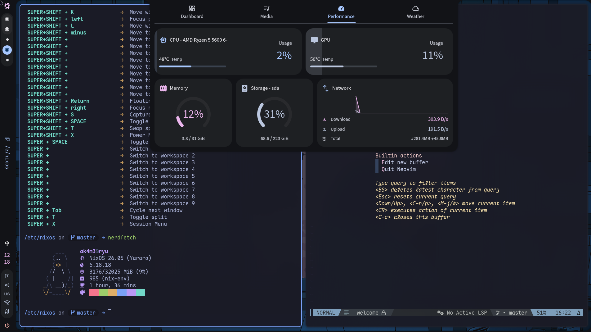
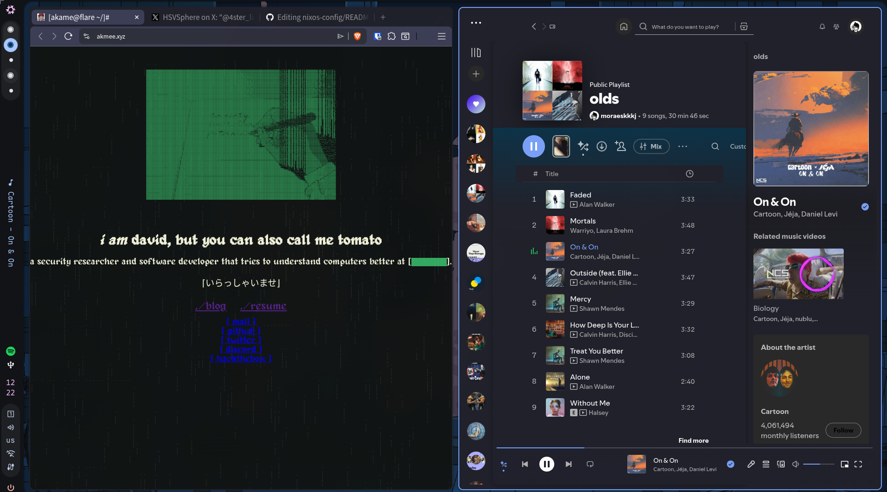
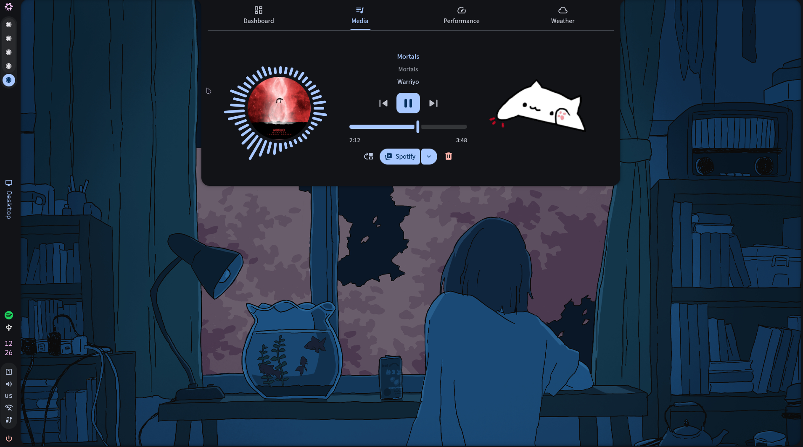

# NixOS config

Here lies the configuration of my NixOS machines. The active hosts are `ryu` (desktop), `sora` (laptop), and `shiro` (home server/media stack).

## Showcase

### Ryu, main desktop:

### Sora, Laptop

coming soon

## Tooling

- hyprland (window manager)
- caelestia-shell (desktop shell)
- ghostty (terminal emulator)
- fish (shell)
- yazi (file manager)
- Neovim + nvf (text editor)
- brave (browser)

## Structure

- `flake.nix` - inputs and host inventory.
- `hosts/` - per-machine composition, hardware config, and host-specific services.
- `modules/` - reusable NixOS modules, grouped by responsibility:
  - `core/` - Home Manager integration, Nix settings, users, OpenSSH.
  - `boot/` - bootloader choices (`systemd-boot`, lanzaboote/Secure Boot).
  - `desktop/` - workstation defaults, Hyprland, SDDM, audio, fonts.
  - `hardware/` - shared hardware support such as AMD GPU settings.
  - `virtualisation/` - container/runtime modules.
  - `gaming/` - Steam/GameMode/Gamescope stack.
- `home/` - programs specific configuration. (Shell, Terminal, Browser and such)
- `themes/` - themes files created using stylix and imported by the `hosts/var.nix` file.
- `home/programs/nvf/` - neovim + nvf config
- `hosts/shiro/media/docs/` - shiro media-stack operator docs

hosts:

- `ryu` - main desktop
- `sora` - laptop
- `shiro` - home server/media stack

## Special Thanks

[anotherhadi/nixy](https://github.com/anotherhadi/nixy)

[harbinger/hyprdots](https://github.com/BinaryHarbinger/hyprdots)

[gmkonan/flake](https://github.com/GMkonan/flake)

### To do

- [ ] tab to accept suggestion nvim
